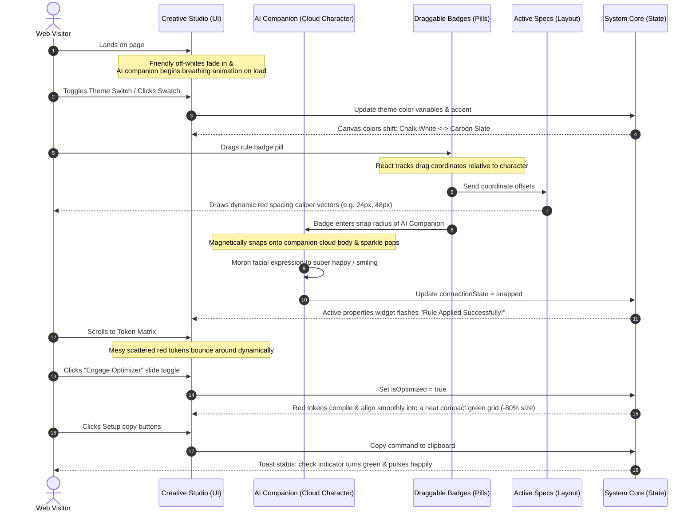

# Flow Overview: User Journey & Interaction

This document maps out the interactive navigation flow, layout layers, and event-handling transitions of the website using a Mermaid sequence diagram.

## Interaction Flow Schematic

