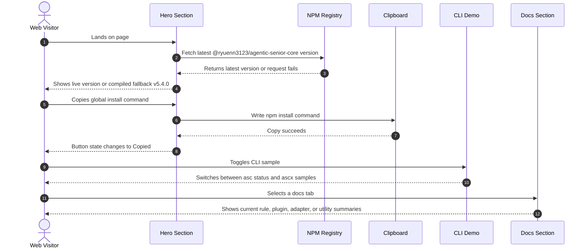

# Flow Overview

This document maps the current user journey and interaction flow.

```mermaid
sequenceDiagram
    autonumber
    actor Visitor as Web Visitor
    participant Hero as Hero Section
    participant Registry as NPM Registry
    participant Clipboard as Clipboard
    participant CLI as CLI Demo
    participant Docs as Docs Section

    Visitor->>Hero: Lands on page
    Hero->>Registry: Fetch latest @ryuenn3123/agentic-senior-core version
    Registry-->>Hero: Returns latest version or request fails
    Hero-->>Visitor: Shows live version or compiled fallback v5.4.0

    Visitor->>Hero: Copies global install command
    Hero->>Clipboard: Write npm install command
    Clipboard-->>Hero: Copy succeeds
    Hero-->>Visitor: Button state changes to Copied

    Visitor->>CLI: Toggles CLI sample
    CLI-->>Visitor: Switches between asc status and ascx samples

    Visitor->>Docs: Selects a docs tab
    Docs-->>Visitor: Shows current rule, plugin, adapter, or utility summaries
```
